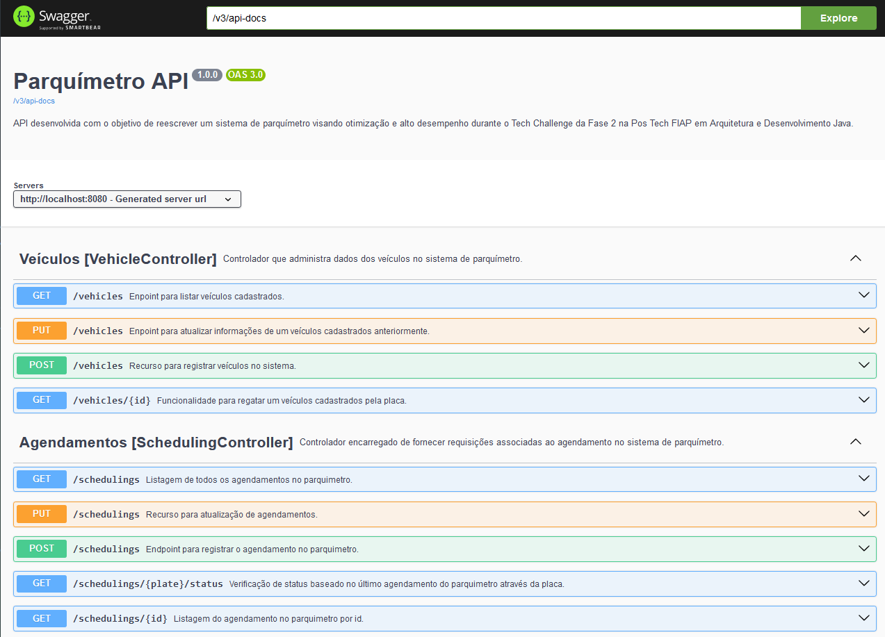

# Second Tech Challenge - Parquímetro API

## Technical documentation
> Custom link: [`http://application-host:8080/swagger.html`](localhost:8080/swagger.html) 

<!--- [Spring Boot Initial structure of project](https://start.spring.io/#!type=maven-project&language=java&platformVersion=3.2.3&packaging=jar&jvmVersion=17&groupId=br.com.fiap.equipe3&artifactId=second-tech-challenge&name=second-tech-challenge&description=Tech%20Challenge%20Fase%202%20Pos%20Tech%20FIAP%20-%20Arquitetura%20e%20Desenvolvimento%20em%20Java&packageName=br.com.fiap.equipe3.second-tech-challenge&dependencies=web,data-jpa,data-mongodb,data-mongodb-reactive,devtools,lombok) -->